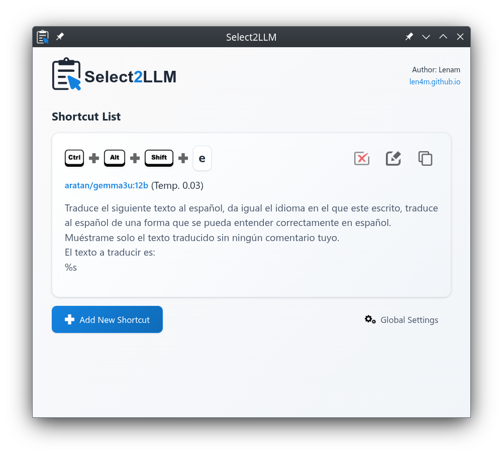

# Select2LLM

**Select2LLM** es una herramienta en desarrollo que permite acceder y procesar texto seleccionado en cualquier aplicación usando modelos de lenguaje (LLMs) cargados en [Ollama](https://ollama.com) con una simple combinación de teclas. La aplicación está diseñada para agilizar tu flujo de trabajo diario, facilitando tareas como traducciones, correcciones, resúmenes, creación de código, informes, generación de comandos, y mucho más.




## Características

- **Acceso rápido y configurable a modelos LLM**: Selecciona texto en cualquier aplicación y envíalo a un modelo de tu elección con una simple combinación de teclas.
- **Soporta múltiples combinaciones de teclas y prompts**: Configura diferentes combinaciones de teclas para acceder a diferentes modelos LLM con distintos prompts predefinidos, añadiendo el texto seleccionado al final del prompt.
- **Gestión de configuraciones desde la aplicación**: La configuración de combinaciones de teclas y prompts se realiza directamente desde la interfaz de la aplicación, sin necesidad de editar archivos manualmente.
- **Lista de modelos ordenada alfabéticamente**: Los modelos disponibles en Ollama se muestran organizados alfabéticamente para facilitar la selección.
- **Filtrado inteligente de contenido de thinking**: Los modelos con capacidad de razonamiento (como o1) filtran automáticamente el contenido de `<think>` para mostrar solo la respuesta final.
- **Configuración global personalizable**: Define preferencias generales como el idioma, temperatura del modelo y otros parámetros globales desde un archivo de configuración sencillo.
- **Arquitectura de servicios mejorada**: Sistema robusto con manejo de errores, logging y gestión de configuración modular.
- **Flexibilidad de uso**: Procesa el texto seleccionado con cualquier modelo LLM cargado en Ollama para generar respuestas de manera ágil y eficiente.
- **Privacidad de tus datos**: Al utilizar Ollama, evitas depender de APIs externas (como OpenAI) y mantienes la privacidad de tus datos procesados.

## Requisitos

### Requisitos de Sistema

- **Linux con X11**: Requiere tener instalados `xclip` y `xdotool`.
- **Windows**: Necesita tener **PowerShell** instalado y activado.
- **macOS**: Futuras versiones planean soporte para macOS.

### Dependencias Adicionales

Para que Select2LLM funcione correctamente, es necesario instalar algunas dependencias en función del sistema operativo:

- **Ollama**: Se necesita tener [Ollama](https://ollama.com) instalado y al menos un modelo descargado. Puedes descargar Ollama desde [https://ollama.com/download](https://ollama.com/download).
  
  Luego, para instalar el modelo `llama3.2`, ejecuta:

  ```bash
  ollama pull llama3.2
  ```

  **Nota**: Select2LLM es compatible con todos los modelos de Ollama, incluyendo modelos con capacidad de razonamiento que utilizan etiquetas `<think>`. La aplicación filtra automáticamente el contenido de thinking para mostrar solo las respuestas finales.

- **Linux**:
  - **xclip** y **xdotool**: Para instalar estas dependencias, ejecuta:
    ```bash
    sudo apt-get install xclip xdotool
    ```

- **Windows**:
  - Asegúrate de tener **PowerShell** instalado y activado. PowerShell viene preinstalado en la mayoría de las versiones de Windows modernas, pero si es necesario, puedes descargarlo desde [la página oficial de Microsoft](https://docs.microsoft.com/es-es/powershell/).

## Instalación de Select2LLM

Puedes instalar **Select2LLM** de dos maneras: descargando las compilaciones disponibles o construyéndolo desde el código fuente.

### 1. Instalación desde Compilaciones

Para una instalación más sencilla, puedes descargar los archivos de compilación ya generados.

- **[Descargar versión de Windows](https://drive.proton.me/urls/RREPSZKDPC#4wxFbVkzBCZY)** (solo para pruebas)
- **[Descargar versión de Linux](https://drive.proton.me/urls/6YGP612944#2JojPNlXBfW3)** (solo para pruebas)

> **Advertencia**: Las versiones proporcionadas son únicamente para propósitos de prueba. No nos hacemos responsables de cualquier problema que pueda ocurrir durante su uso. Actualmente, la versión de Windows no funciona muy bien y la versión de Linux está limitada a sistemas X-Windows.

Una vez descargado el archivo:

1. Descomprime o ejecuta el archivo descargado en tu sistema operativo correspondiente.
2. Sigue las instrucciones en pantalla para finalizar la instalación.

### 2. Instalación desde el Código Fuente

Si prefieres instalarlo desde el código fuente:

1. **Clonar el repositorio**
    ```bash
    git clone https://github.com/Len4m/select2llm.git
    ```
   
2. **Instalar dependencias**
    Navega a la carpeta del proyecto y ejecuta el siguiente comando para instalar las dependencias:
    ```bash
    npm install
    ```

3. **Construir la aplicación**
    Para crear un archivo ejecutable `.AppImage` de Select2LLM en la carpeta `dist`, usa el siguiente comando:
    ```bash
    npm run build
    ```

4. **Ejecutar la aplicación**
    Si deseas iniciar la aplicación sin crear un `.AppImage`, puedes utilizar:
    ```bash
    npm start
    ```

## Configuración de Select2LLM

### Configuración de combinaciones de teclas y prompts

La configuración de combinaciones de teclas y prompts se realiza directamente desde la interfaz de la aplicación. Los ajustes se guardan automáticamente en un archivo `shortcuts.json` que se encuentra en la carpeta del usuario, dentro de `.select2llm`.

El formato de este archivo es el siguiente:

```json
[
  {
    "ctrl": true,
    "shift": true,
    "alt": true,
    "key": "t",
    "prompt": "Traduce el siguiente texto al inglés. Devuelve únicamente la traducción en inglés sin incluir ningún comentario, explicación ni texto adicional:",
    "model": "llama3.2:latest",
    "temperature": 0.7,
    "overlay": true
  },
  {
    "ctrl": true,
    "shift": true,
    "alt": true,
    "key": "p",
    "prompt": "Mejora esta programación para que sea más corta y más eficiente, muéstrame solo la programación sin incluir ningún comentario, explicación ni texto adicional:",
    "model": "mistral:instruct",
    "temperature": 0.6,
    "overlay": true
  },
  {
    "ctrl": true,
    "shift": true,
    "alt": true,
    "key": "g",
    "prompt": "%s",
    "model": "gemma2:latest",
    "temperature": 0.28,
    "overlay": false
  }
]
```

- **ctrl**, **shift**, **alt**: Valores booleanos que definen si estas teclas deben ser parte de la combinación.
- **key**: La tecla principal que activará el prompt.
- **prompt**: El mensaje que se enviará al modelo LLM, con el texto seleccionado añadido al final.
- **model**: El modelo LLM cargado en Ollama que se utilizará para procesar el texto.
- **temperature**: Establece la "creatividad" del modelo LLM para esta configuración específica, con valores más altos generando respuestas más variadas.
- **overlay**: Establece si se mostrará una ventana superpuesta en la aplicación donde el texto es escrito por select2llm y generado por Ollama.

### Configuración Global

Además de la configuración de atajos y prompts, Select2LLM permite definir parámetros globales que afectan al comportamiento general de la aplicación. Esta configuración se guarda automáticamente en un archivo `config.json` en la carpeta del usuario, dentro de `.select2llm`.

El formato de este archivo es el siguiente:

```json
{
  "language": "es",
  "temperature": 0.8,
  "keep-alive": 5,
  "host": "http://127.0.0.1:11434"
}
```

- **language**: Define el idioma preferido para la interfaz de usuario (actualmente inglés, español y catalán).
- **temperature**: Valor por defecto de creatividad del modelo para todas las consultas.
- **keep-alive**: Tiempo en minutos que el modelo permanecerá en memoria.
- **host**: URL del servidor Ollama que se utilizará para procesar las peticiones.

## Uso

1. Selecciona cualquier texto en una aplicación de tu computadora.
2. Usa la combinación de teclas configurada para enviar el texto seleccionado al modelo LLM preconfigurado en Ollama.
3. Recibe la respuesta procesada y disfruta de la eficiencia en tu flujo de trabajo.

> La aplicación utiliza el portapapeles y `xdotool` para acceder al contenido seleccionado en otras aplicaciones y simular pulsaciones de teclas.

## Mejoras Técnicas Recientes

### Filtrado Inteligente de Thinking
Select2LLM incluye un sistema avanzado de filtrado que procesa automáticamente las respuestas de modelos con capacidad de razonamiento:

- **Detección automática**: Identifica y filtra contenido entre etiquetas `<think>` y `</think>`
- **Procesamiento en tiempo real**: Mantiene la experiencia de streaming mientras filtra el contenido de razonamiento
- **Manejo seguro de etiquetas**: Evita mostrar contenido parcial cuando las etiquetas se dividen entre chunks del stream
- **Compatibilidad universal**: Funciona con cualquier modelo que utilice el formato de thinking

### Arquitectura de Servicios
La aplicación ha sido refactorizada con una arquitectura modular y robusta:

- **OllamaService**: Gestión mejorada de la comunicación con Ollama
- **ConfigService**: Manejo centralizado de configuración con validación
- **ErrorService**: Sistema de manejo de errores robusto y consistente
- **Logger**: Sistema de logging estructurado para depuración y monitoreo
- **PlatformService**: Abstracción multiplataforma mejorada

### Organización de Modelos
- **Ordenación alfabética**: Los modelos se muestran automáticamente ordenados por nombre
- **Gestión mejorada**: Lista más clara y fácil de navegar en la interfaz de configuración

## Motivación del proyecto

La idea detrás de Select2LLM surgió por la frustración de tener que buscar plugins para ChatGPT/Ollama en cada aplicación donde quería usar LLMs, lo cual resultaba en una experiencia deficiente y, generalmente, terminaba en la API de OpenAI, sacrificando la privacidad de mis datos procesados. Con Select2LLM, ahora es posible acceder a diferentes modelos y prompts preconfigurados con solo una pulsación de teclas, haciendo que cualquier tarea sea más eficiente.

## Descarga

Las compilaciones de **Select2LLM** para **Windows** y **Linux** están disponibles únicamente con fines de pruebas. Actualmente, la versión de Windows no funciona muy bien y la versión de Linux está limitada a sistemas X-Windows.

- [Descargar versión de Windows](https://drive.proton.me/urls/RREPSZKDPC#4wxFbVkzBCZY) (solo para pruebas)
- [Descargar versión de Linux](https://drive.proton.me/urls/6YGP612944#2JojPNlXBfW3) (solo para pruebas)

> **Advertencia**: Las versiones proporcionadas son únicamente para propósitos de prueba. No nos hacemos responsables de cualquier problema que pueda ocurrir durante su uso.

## Colaboración

Select2LLM es la primera aplicación que desarrollo en [Electron](https://www.electronjs.org/), por lo que es muy probable que haya errores y muchas cosas por mejorar. ¡Toda colaboración es bienvenida! Si tienes sugerencias, mejoras o simplemente quieres contribuir, no dudes en abrir un issue o crear un pull request en el repositorio.

## Mejoras Futuras

- **Mejoras de interfaz**: Optimización de la experiencia de usuario en la interfaz de configuración
- **Soporte multiplataforma**: Mejorar el soporte para Windows y completar el desarrollo para macOS
- **Opciones de salida**: Dar la opción de enviar el resultado con pulsado de teclas o con pegar desde el portapapeles
- **Plantillas de prompts**: Sistema de plantillas predefinidas para casos de uso comunes
- **Historial de interacciones**: Registro opcional de consultas realizadas
- **Temas personalizables**: Soporte para temas claros y oscuros en la interfaz
- **Actualizaciones automáticas**: Sistema de actualización automática de la aplicación

## Licencia

Este proyecto está licenciado bajo la Licencia **GPL-3**. Consulta el archivo `LICENSE` para más detalles.

---

Espero que Select2LLM sea una herramienta útil para quienes buscan una forma rápida y privada de interactuar con modelos LLM y mejorar su productividad en tareas cotidianas.
